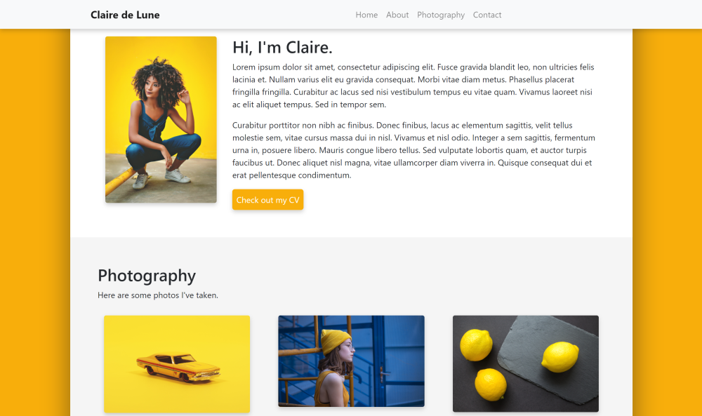
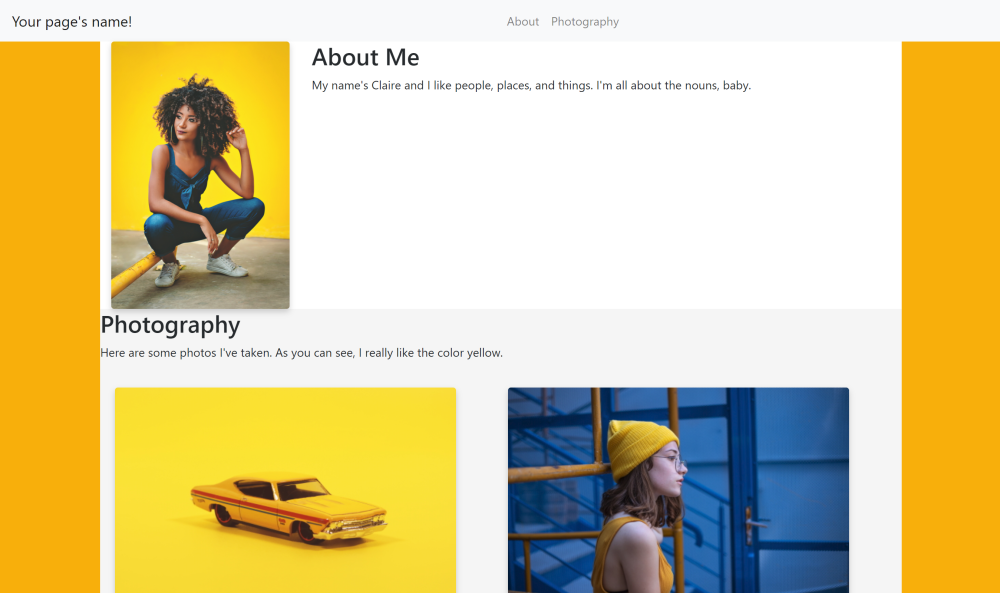
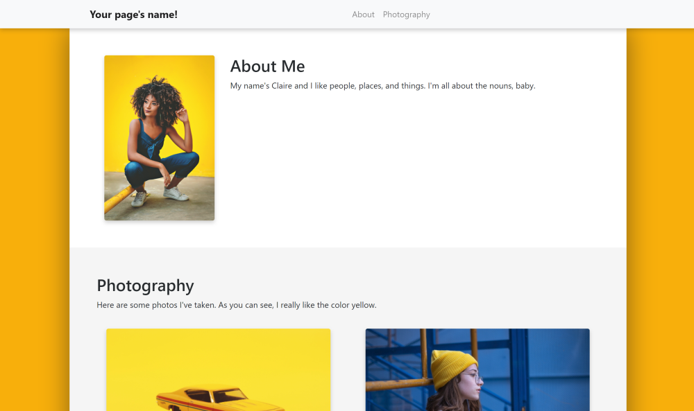
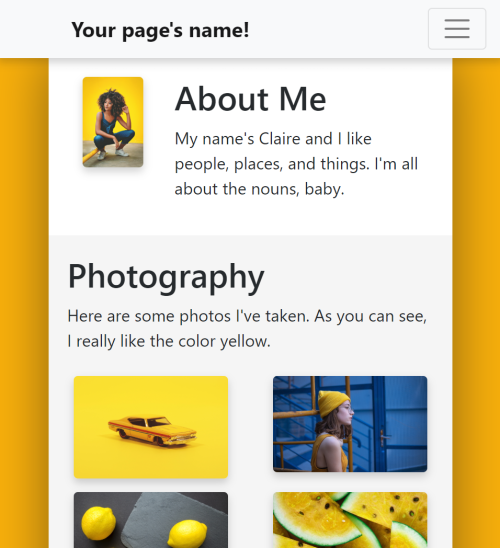
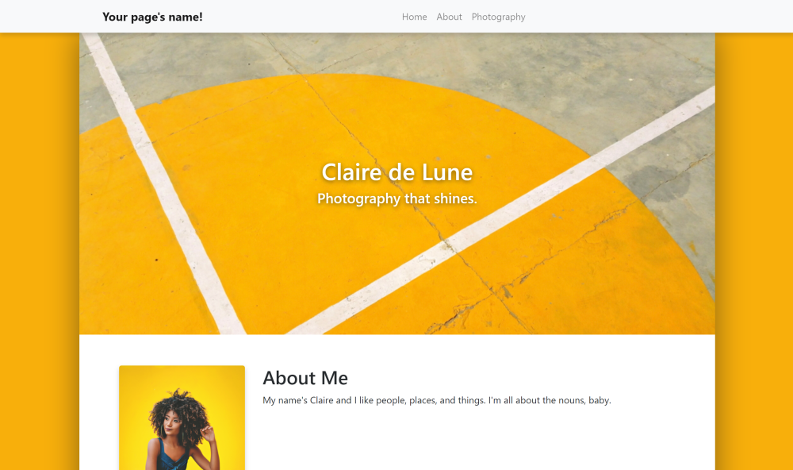
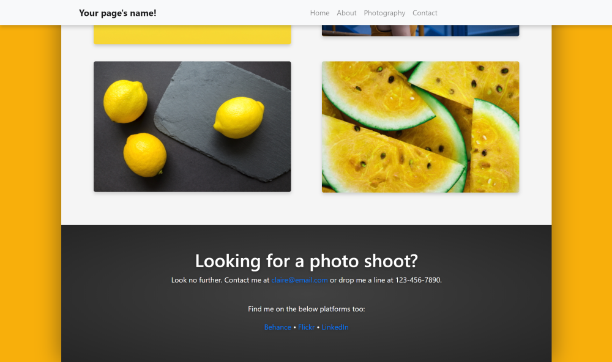

# How to code a simple website using Bootstrap  

  

This guide will teach you how to code a website like the one above.  

Before we get into things, here are some links to resources you might use during 
your web development:  
- https://getbootstrap.com/
- https://www.w3schools.com/
- https://pexels.com  

You'll also need a text editor like Visual Studio Code (which I use), Notepad++, 
or Sublime.  

## Background: What are HTML, CSS, and Bootstrap?  

**HTML** is what holds the content of the page, like text, photos, and links.  
**CSS** is what styles the content of the page so that it's structured nicely and has colors and other decorations.  
**Bootstrap** is a framework that simplifies coding a website by providing tools for
structuring the site more easily, and automatically adjusts your page for different browser sizes 
(don't you hate when a website loads weird on your desktop vs your phone?).  

Think of it like this: HTML is the blueprint of your rooms and furniture, CSS is the interior 
designer who places everything properly and decorates, and Bootstrap is a carpenter 
who helps make building simpler by providing pre-built arches, doors, etc.  

To make a page, technically only HTML is needed, but CSS is always included since it would look 
like a page from the 90's otherwise. Additionally, Bootstrap is totally optional, but it makes 
building a website much easier -- especially because it automatically adjusts for different 
screen sizes.  
  
  
  


## Objective 1: Create the basic site layout  

We'll work on the HTML file first, since we have to make the skeleton for the site before 
we can decorate it.  
  

### Step 1a: Set up the HTML file  

Create a new folder (aka directory) and create two files: `index.html` and `index.css`. 
Then open `index.html` in a text editor like Visual Studio Code, Sublime, etc.  

HTML consists of opening and closing tags that are almost all formatted like `<tag>some stuff</tag>`. 
It's also organized into a `<head>` and a `<body>` section, where `<head>` is info for the browser 
(such as page title) and `<body>` holds the meat and potatoes of the page, such as paragraphs and photos.  

These are some of the tags that are necessary for the browser to decipher what the HTML file actually means, 
and we'll put those first in our empty HTML files:  

```html
<!DOCTYPE html>
<html>
    <!-- Head section holds info for the browser. -->
    <head>

    </head>
    <!-- Body holds the content of the page. -->
    <body>

    </body>
</html>
```
##### As a note: Anything within the `<!-- blah -->` tags are comments and the computer doesn't read them -- they're for human use. 
##### Try using them to organize your code and keep track of your tags!  

Inside our `<head>` section, let's add some preliminary text so the computer knows 
the title of our page, its encoding type, how it should be styled (i.e. a link to 
our CSS file), and links to the Bootstrap files we'll use:  

```html
		<!-- Our page's title and custom styling file. -->
		<title>Sample Page</title>
        <link rel="stylesheet" href="index.css" type="text/css">
        
        <!-- Info for the browser to decode our HTML code. -->
		<meta charset="utf-8" />
		<meta http-equiv="X-UA-Compatible" content="IE=edge">
		<meta name="viewport" content="width=device-width, initial-scale=1">

		<!-- Bootstrap files -->
		<link rel="stylesheet" href="https://maxcdn.bootstrapcdn.com/bootstrap/4.0.0/css/bootstrap.min.css" integrity="sha384-Gn5384xqQ1aoWXA+058RXPxPg6fy4IWvTNh0E263XmFcJlSAwiGgFAW/dAiS6JXm" crossorigin="anonymous">
		<script src="https://code.jquery.com/jquery-3.2.1.slim.min.js" integrity="sha384-KJ3o2DKtIkvYIK3UENzmM7KCkRr/rE9/Qpg6aAZGJwFDMVNA/GpGFF93hXpG5KkN" crossorigin="anonymous"></script>
		<script src="https://cdnjs.cloudflare.com/ajax/libs/popper.js/1.12.9/umd/popper.min.js" integrity="sha384-ApNbgh9B+Y1QKtv3Rn7W3mgPxhU9K/ScQsAP7hUibX39j7fakFPskvXusvfa0b4Q" crossorigin="anonymous"></script>
		<script src="https://maxcdn.bootstrapcdn.com/bootstrap/4.0.0/js/bootstrap.min.js" integrity="sha384-JZR6Spejh4U02d8jOt6vLEHfe/JQGiRRSQQxSfFWpi1MquVdAyjUar5+76PVCmYl" crossorigin="anonymous"></script>
``` 
  

### Step 1b: Use Bootstrap to plan layout  

Bootstrap has regular HTML tags like div, span, etc. but uses built-in "classes," 
which are basically types of components. If we're using the metaphor from before, 
these are the structures pre-built by our carpenter.  

For our website, we'll have a navbar at the top, then all our content in a big 
column container in the middle of the screen. Within that column, we'll have rows, 
which each constitute a section of the page, such as description, bio, etc. 

Let's set up the layout using Bootstrap `<div>` classes, which just hold **div**isions 
of our page. HTML loads pretty logically (i.e. things at the top of the code load first, and 
things inside a `<div>` will be nested inside the component). Don't forget closing tags! 

Since the stuff is content, we put it in our `<body>` section:  

```html
<body>
    <!-- Navbar -->

    <!-- Page container -->
    <div class="container-fluid">
        
        <!-- Main column where content goes -->
        <div class="col">

            <!-- About section -->
            <div class="row">

            </div>

            <!-- Photography section -->
            <div class="row">

            </div>

        </div>
    </div>

</body>
```  

Your page should now be a blank document. Feel free to check if you've organized 
it correctly [at this code page](demo1.html).  

Now that we've planned a layout, it's time to fill the sections.  
  


## Objective 2: Fill in our sections' content  

Now that we've set up the page layout, let's fill in the navbar, about section, 
and a section to show off our skillz.  
  

### Step 2a: Build the navbar  

The navbar is always a little difficult to understand, so I've added some extra 
comments below if you want to know what's happening under the hood. If not, feel 
free to remove them, since they won't impact the code.  

We can just copy paste the premade navbar code from the Bootstrap site into our page, right 
below the navbar section we just made:  

```html
    <!-- Navbar -->
    <!-- This builds a blank navbar with some styling, such as a light color. -->
    <nav class="navbar navbar-expand-md navbar-light bg-light justify-content-center">
        <!-- This is the "brand" that goes all the way to the left. -->
        <a class="navbar-brand d-flex w-50 mr-auto" href="#home">Your page's name!</a>

        <!-- This button replaces the links list when in mobile. -->
        <button class="navbar-toggler" type="button" data-toggle="collapse" data-target="#nav">
            <span class="navbar-toggler-icon"></span>
        </button>

        <!-- Navbar links -->
        <div class="collapse navbar-collapse" id="nav">
            <!-- Create an unordered list to hold our links and format it automatically. -->
            <ul class="nav navbar-nav mr-auto justify-content-end">
                <!-- All the links in the navbar will be listed below as list items using the <li> tag. -->
                <li class="nav-item">
                    <!-- To make them into links, we use the <a href="link"> tag. -->
                    <!-- The class="nav-link" part just makes them display nicely. -->
                    <a class="nav-link" href="#about">About</a>
                </li>
                <li class="nav-item">
                    <a class="nav-link" href="#photography">Photography</a>
                </li>
            </ul>
        </div>
    </nav>
```  

Great! Now we have a functional navbar that links to the different sections of our 
page using `#headername` links -- these will automatically move the browser to those 
sections when clicked.  
  
  
### Step 2b: About section  

For our "about" section, we'll have a photo on the left with text to the right. 
We can order the components using Bootstrap's `col` classes.  

Its column system consists of dividing containers into 12 parts, and allowing you 
to, for example, make 1 section 3 units wide, and the rest 9 units wide. The units 
will automatically adjust their width based on the width of the browser.  

Let's organize the about section that same way -- within the about section, let's 
label it using `id="about"` within the `<div>` tag for the row, and then separate 
that row into columns:  

```html
            <!-- About section -->
            <div class="row" id="about">

                <div class="col-3">
                    
                </div>

                <div class="col-9">
                    
                </div>

            </div>
```  

Next up, let's fill those columns. Let's first add a beautiful selfie in the first 
column using Bootstrap's `class="img-fluid"` class, so it adjusts its size automatically:  

```html
            <div class="col-3">
                
            </div>
```  

Then fill the second column with a header of priority 2 and put its description 
text inside a  `<span>` class so we can edit the formatting of the content inside 
it without having to make it its own `<div>`. Finally, we can edit the actual description 
using `<p>` to designate a paragraph:  

```html
            <div class="col-9">
                <h2>About Me</h2>

                <span class="align-middle">
                    <p>
                        My name's Claire and I like people, places, and things. I'm all about the nouns, baby.
                    </p>
                </span>
            </div>
```
##### As a note, pressing enter doesn't do anything to a paragraph. To separate paragraphs, either create a new one using `<p>`, or put `<br>` to enter a line break.

Cool, now our About section has a picture of our gorgeous visage and some text 
about us. Now we ought to put some stuff to show off our talents.  
  

### Step 2c: Photography section

For the sake of this tutorial, we'll pretend we're photographers (and if you actually 
are one, then... you're doing great already!).  

Let's again label our photography section using `id="photography"` in the row's 
`<div>` tag, and put some sample text inside a fluid column so it can resize 
automatically inside the row that contains it:  

```html
            <!-- Photography section -->
            <div class="row" id="photography">

                <div class="column-fluid">

                    <h2>Photography</h2>

                    <p>
                        Here are some photos I've taken. As you can see, I really 
                        like the color yellow.
                    </p>

                    <!-- Photo gallery -->

                </div>

            </div>
```

Before we build our photo gallery, let's put some photos in a folder so the page 
automatically loads them.  

HTML uses links, but unless the link has `https://` before the URL, it'll assume 
it's local, i.e. it's in the same folder that index.html is housed. To be organized, 
create a new folder called `media` and input the photos you want to use as `photo1.jpg` 
etc. Then, so that they link correctly, we use the `` tag 
to say "put an image here, which can be found in the folder `media`, which is in the 
same folder as the current folder."  

Now we can populate our mini gallery using that system. We'll build the photo gallery 
by using Bootstrap's grid system again, creating two rows (one above the other) 
and assigning each photo to 6 units wide horizontally so each takes up half of 
the column that holds them:  

```html
                    <!-- Photo gallery -->

                    <!-- Top row -->
                    <div class="row">
                        <!-- Top left photo -->
                        <div class="col-6">
                            <!-- Designate that it's a thumbnail so it has a nice border. -->
                            <div class="thumbnail">
                                
                            </div>
                        </div>

                        <!-- Top right photo -->
                        <div class="col-6">
                            <div class="thumbnail">
                                
                            </div>
                        </div>
                    </div>

                    <!-- Bottom row -->
                    <div class="row">
                        <!-- Bottom left photo -->
                        <div class="col-6">
                            <div class="thumbnail">
                                
                            </div>
                        </div>
                        <!-- Bottom right photo -->
                        <div class="col-6">
                            <div class="thumbnail">
                                
                            </div>
                        </div>
                    </div>
```  

If all goes according to plan, our website should now look like this:  

  

If not, check the difference between your code and [the code found here](demo2.html).  

Let's go onward!  
  
  
  
  
  
## Objective 3: Spiff up the site using CSS  

As you can see from the photo, it looks kinda... well, wack. So let's make it 
pretty using CSS (which, following our house analogy, is the interior designer). 

### Step 3a: Add the basics  

By basics, I mean make it scroll smoothly, add color, and pad the sections so they 
don't put text too close to the edges, for example.  

Unlike HTML, CSS doesn't require a header for decoding or linking to files, so just 
open it and let's add these basics:  

```css
/* This is how you write a comment in CSS! */

/* Make the navbar links sliiide to their targets, instead of jumping. */
html {
    scroll-behavior: smooth;
}

/* Color the background and add some space to the sides of the main column. */
.container-fluid {
    background-color: #F8B003;
    /* We use !important to override the padding setting that Bootstrap already put for the container-fluid class. */
    padding-left: 10% !important;
    padding-right: 10% !important;
}

/* Color the main column background white. */
.col {
    background-color: white;
}

/* Put a nice frame with smoothened corners and a soft shadow around all images on the page. */
img {
    border: 4px solid white;
    border-radius: 4px;
    box-shadow: 0px 4px 8px rgba(17,17,17,0.2);
}

/* Color the second (photography) section's background light gray for contrast. */
#photography {
    background-color: whitesmoke;
}

/* Space out the photos in our gallery a little. */
.thumbnail {
    margin: 4%;
}
```  

And the result is (imagine a drum roll here):  

  

Cool, this website works, but it still has *a lot* of room for improvement. Let's 
start editing both the HTML *and* CSS using custom tags so that we can customize 
the existing Bootstrap skeleton to our liking.  
  
  
## Step 3b: A briefing on CSS syntax  

You might have noticed that the CSS we wrote before has some entries start with `element`, 
some with `.element`, and some with `#element`. Here is where their differences
become important:  

- `element` (i.e. the one without a symbol prefix) is a built-in tag, such as ``, 
`<li>`, or `<table>`. This means it's a basic HTML component; no customization is involved.  
- `.element` signifies the element is a custom class, like `.container-fluid`. 
Think of classes like a brand: they can be reused on multiple elements, and anytime 
you create a new element with the class (e.g. `<div class="element">`) it automatically 
gets all the class's defined attributes from the CSS file.
    - Did you notice how all the images labeled with `class="thumbnail"` in our photo 
    gallery got the same `4%` padding? That's the `class` in action!  
- `#element` signifies the element has a custom ID, like in `#photography`. An ID 
is typically used only once and refers to a single specific thing we defined. Otherwise, 
it behaves exactly like a class.
    - Note that the navbar link for photography, `<a href="#photography">`, will 
    make the page look for and then jump to the element with the ID "photography". 
    The link wouldn't work correctly if there were multiple things with that label, 
    unlike a class.  
  
It's also handy to know the difference between `padding` and `margin`. Although 
both put spacing around an element, they do it in different ways. Let's imagine our 
element as Earth and the content inside it (say, a `<p>` paragraph) as the core:    
- `padding` is like the magma inside Earth. It surrounds the core (the content) 
and puts spacing *inside* Earth, between its core and its surface.  
- `margin` is like the atmosphere outside Earth. It puts spacing *outside* Earth, 
between its surface and outer space.  

Although you could put a `margin` on all `p` elements, it's bad practice since 
every single paragraph would have extra space around it, and the container won't 
apply the same spacing to photos and other elements inside it like `padding` would.  

Hopefully that clears up some confusion you might have had.  

## Step 3c: Use HTML and CSS in tandem  

OK, now back to coding our site. Let's add secondary classes to some of the Bootstrap 
elements we used before, so we can use the original classes *in addition to* customized 
ones.

In our HTML, we used `<div class="col">` to designate the main column. Let's edit 
it to have a drop shadow by branding it with the class `main`. While we're at it, 
let's label the section rows with  `<div class="row section"...` before the 
id of each `div`. (Note: don't edit the rows we used in the photo gallery, as we 
want those to stay as is.)  

```html
        <!-- Page container -->
        <div class="container-fluid">
            ...
            <!-- Main column where content goes -->
            <div class="col main">
                ...
                <!-- About section -->
                <div class="row section" id="about">
                    ...
                </div>

                <!-- Photo section -->
                <div class="row section" id="photography">
                    ...
                </div>
            </div>
        </div>
```  

Then, in the CSS, we'll add some lines that target only rows with the additional 
class `section`, and another that targets the column with class `main`:  

```css
.col.main {
    background-color: white;
    box-shadow: 0 0 50px rgba(17,17,17,0.5);
}

.row.section {
    padding: 5%;
}
```  

Great! Now our spacing is fixed. While we're coding CSS, let's add a shadow to the 
navbar. We don't have to edit the HTML for this, just the CSS, since we're using 
the default navbar:  

```css
.navbar {
    box-shadow: 0px 4px 8px rgba(17,17,17,0.2);
}
```  

And let's bold the navbar's title (called "brand" by Bootstrap) and move it a 
little to the right, so it aligns with the content column:  

```css
/* Bold the navbar's brand and put spacing on its left so it shifts right. */
.navbar-brand {
    font-weight: bold;
    padding-left: 12%;
}
```

You might notice that the navbar has also been flatly lying on the page. We can 
make it sticky, i.e. it will scroll along with the user, by encasing the navbar 
section in our HTML in another `stick-top` div class:  

```html
<!-- Make the navbar "sticky" (sticks to top of screen) -->
<div class="sticky-top">

    <!-- Navbar -->
    <nav class="navbar navbar-expand-md navbar-light bg-light justify-content-center">
        ...
    </nav>

</div>
```  

Now let's see the result:  

  

Lookin' good! And thanks to Bootstrap, it looks good even on smaller screens:  

  

(If you have any issues, check [the HTML here](demo3c.html) and [the CSS here](demo3c.css).  

In fact, this could be a finished site! But if you want more, let's add a little 
more to our site.  
  


## Objective 4: Add a header and contact section to the page  

Next up, we'll add a header at the top of the page, along with a contact section 
at the bottom. We'll still use the row system from before, but the uniqueness of 
each section will mean we use even more customized HTML tags and CSS code.  
  

### Step 4a: Add a header  

Our header will consist of a photo of a background with some text on top of the 
photo. Since HTML works logically (usually), we can create a `<div>` for the header, 
use a `<div>` with a background image for the image (instead of ``), and 
finally put some text in that `<div>`. Let's put it into action!  

After `<div class="col main">` but before `<!-- Acout section -->`, put the following:  

```html
<!-- Header section -->
<div class="row section" id="home">
    <div class="header">
        <h1>Claire de Lune</h1>
        <h4>Photography that shines.</h4>
    </div>
</div>
```  

Then let's customize the placement of the elements using CSS.  

The section with the `home` id should have padding so the text doesn't hug the edge, 
a background image, and should have its background image formatted so it stretches, 
doesn't repeat, and is centered:  

```css
#home {
    padding: 20%;
    background-image: url("media/pavement.jpg");
    background-size: cover;
    background-repeat: no-repeat;
    background-position: center;
    position: relative;
}
```

We want the `header` class's text to be centered horizontally relative to the `home`
div that holds it, and we also want it to be centered vertically. To make it easier 
to read, we also add a shadow to the text:  

```css
.header {
    text-align: center;
    position: relative;
    top: 50%;
    left: 50%;
    transform: translate(-50%, 0);
    color: white;
    text-shadow: 0 2px 8px rgba(17,17,17,0.6);
}
```  

So we've added the section. But don't forget to add a link to it in the navbar!  

```html
<li class="nav-item">
    <a class="nav-link" href="#photography">Photography</a>
</li>
```

The final result should look like this:  



(If it doesn't, there's [HTML here](demo4a.html) and [CSS here](demo4a.css))

Now let's add the contact section. It'll be easy-peasy too.
  

### Step 4b: Add the contact section  

This part's very similar. The format of our contact section will use the same class 
as the header, so it'll be formatted as large, centered, etc. The only difference 
is we'll add links at the bottom of the section to link to our portfolio sites using 
the HTML `<a>` tag.  

At the end of the main column container, after the photography section, add the 
new contact section with `id="contact"`:  

```html
<!-- Contact section -->
<div class="row section" id="contact">
    <div class="bigtext">
        <h1 class="text-center">Looking for a photo shoot?</h1>
        <p>
            Look no further. Contact me at <a href="#">claire@email.com</a> or drop me a line at 123-456-7890.
        </p>
        <br>
        <p>
            Find me on the below platforms too:
        </p>
        <p>
            <a href="#">Behance</a> • <a href="#">Flickr</a> • <a href="#">LinkedIn</a>
        </p>
    </div>
</div>
```  

The only matching CSS we need to add is for the background. Instead of an image, 
we'll put a radial gradient so visitors can focus on the text:  

```css
#contact {
    background-image: radial-gradient(#404040, #202020);
}
```  

Fantastic. Last step: add it to the navbar links!  

```html
<li class="nav-item">
    <a class="nav-link" href="#photography">Photography</a>
</li>
```  

And now the page's bottom looks like this:  



And if it doesn't, check out the [HTML here](demo4b.html) and [CSS here](demo4b.css).  

So with that... we're done! You've completed a Bootstrap personal website super 
quick. Congrats!  

If you have more customizations you want to make, try mixing and matching the components 
we used earlier. I also recommend checking out the Bootstrap documentation, which 
can teach you how to make parts like forms and more.